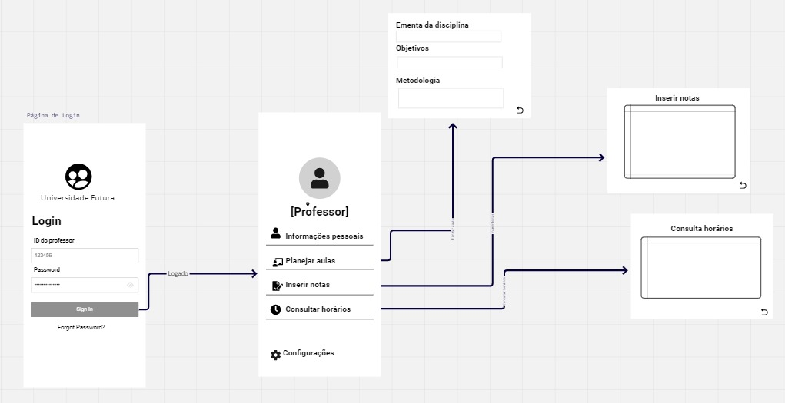
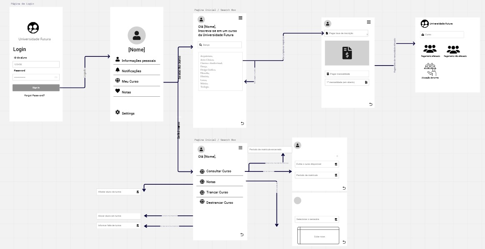
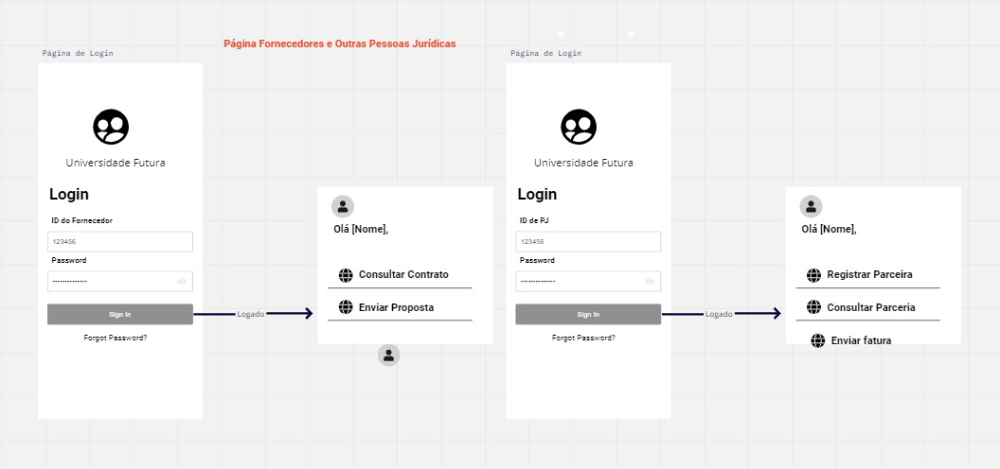

# Sistema de Gestão para Centro Universitário

## Introdução

Neste projeto, buscamos apresentar um sistema orientado a objetos, formalizado com a Linguagem Unificada de Modelagem (UML), que visa a gestão de dados de um centro universitário. A UML serve como uma ferramenta valiosa no processo de desenvolvimento, permitindo que os desenvolvedores visualizem e compreendam as complexidades do projeto de software por meio de diagramas padronizados.

## Diagrama de Casos de Uso

Os cenários abaixo representam ações que podem ser realizadas por diferentes atores no sistema proposto:

- **Pessoa Física:** Consulta de Cursos, Inscrição, Pagamento de taxa de inscrição.
- **Pessoa Jurídica:** Registro de Parceria, Envio de Fatura, Consulta de Parcerias.
- **Professores:** Planejamento de Aulas, Entrada de Notas, Consulta de Horários, Ementa de Disciplina.
- **Fornecedores:** Envio de Propostas, Faturamento, Consulta de Contratos.
- **Alunos:** Inscrição em Cursos, Consulta de Notas, Pagamento de Mensalidade, Trancamento, Destrancamento, Retorno Abandono.

### Cenários Descritos

Para entender melhor como o sistema funciona em prática, consideramos alguns cenários chave, entre eles:

- [Inscrição em Cursos (Aluno)](#inscrição-em-cursos-aluno)
- [Consulta de notas (Aluno)](#consulta-de-notas-aluno)
- [Pagamento de mensalidade (Aluno)](#pagamento-de-mensalidade-aluno)
- [Consulta de cursos (Pessoa Física)](#consulta-de-cursos-pessoa-física)
- [Inscrição (Pessoa Física)](#inscrição-pessoa-física)
- [Pagamento de taxa de inscrição (Pessoa Física)](#pagamento-de-taxa-de-inscrição-pessoa-física)

(Nota: Os cenários específicos foram omitidos aqui para economizar espaço, mas podem ser facilmente incorporados seguindo o formato acima.)

#### Visão das Telas do Sistema do Projeto Integrador

---

**Perfil do Professor:**

Ao realizar o login utilizando seu ID, o professor é conduzido às seguintes funcionalidades:

- Cadastro de plano de aula.
- Registro de notas dos alunos.
- Consulta de horários programados para aulas.

---

**Perfil do Estudante:**

O estudante, após autenticação pelo ID, é direcionado à tela de seleção de curso. Se o aluno estiver inscrito em um curso:

- A tela subsequente apresenta as opções de efetuar pagamentos de mensalidade.
  
Caso o aluno não esteja inscrito em um curso específico:

- Ele será direcionado às opções de busca de curso, visualização de notas e efetuação de pagamentos de mensalidade.

Vale ressaltar que o processo de pagamento de mensalidade é interligado ao perfil da instituição educacional, que recebe o pagamento e vincula ao ID do aluno. O aluno tem, ainda, as opções de trancar ou destrancar seu curso. A opção de trancamento resulta na não alocação do aluno em uma turma, enquanto a de destrancamento tenta alocá-lo. Caso não haja turmas disponíveis, uma notificação é apresentada.

---

**Perfil de Fornecedor e Pessoa Jurídica:**

Tanto fornecedores quanto pessoas jurídicas devem autenticar-se através de um ID. 

Para fornecedores:

- A interface apresenta opções de consulta a contratos existentes e envio de propostas para a instituição.

Para pessoas jurídicas prestadoras de serviços:

- A plataforma permite o cadastro de novas parcerias, a consulta de parcerias já estabelecidas e o envio de faturas relacionadas.

---

## A Importância da Experiência do Usuário (UX) no Projeto

A experiência do usuário (UX) está no cerne do nosso projeto. Um sistema, não importa quão tecnicamente avançado seja, deve ser amigável e intuitivo para seus usuários. A eficácia da UX no nosso projeto pode:

- Construir confiança e satisfação com os usuários.
- Atrair e reter clientes.
- Impulsionar inovação.
- Evitar custos futuros com correções.
- Manter o projeto alinhado às tendências de mercado.

Acreditamos que investir em UX é investir no sucesso do projeto e no valor que ele traz para os usuários.

---

Para mais informações, consulte os diagramas UML, protótipos e documentação detalhada disponíveis nos arquivos do projeto.

## Contribuições

Este projeto é mantido por uma equipe de desenvolvedores dedicados. Se você é membro da equipe, por favor, verifique as [instruções de contribuição](#contribuições) para mais detalhes.

--- 

**Referência**: 
TEIXEIRA, Fabricio. Introdução e boas práticas em UX design. [s.l.]: Casa do Código, 2014.
SANTOS, A. M. dos. et al. DIRETRIZES PARA A CONSTRUÇÃO DE CASOS DE USO EFICAZES. Revista de Informática, vol 2, nº 2, p. 70–75, jul-dez. 2006. Disponível em: https://seer.uscs.edu.br/index.php/revista_informatica_aplicada/article/view/293/259. Acesso em 06 jun 2023.
---
